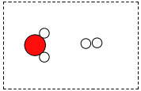
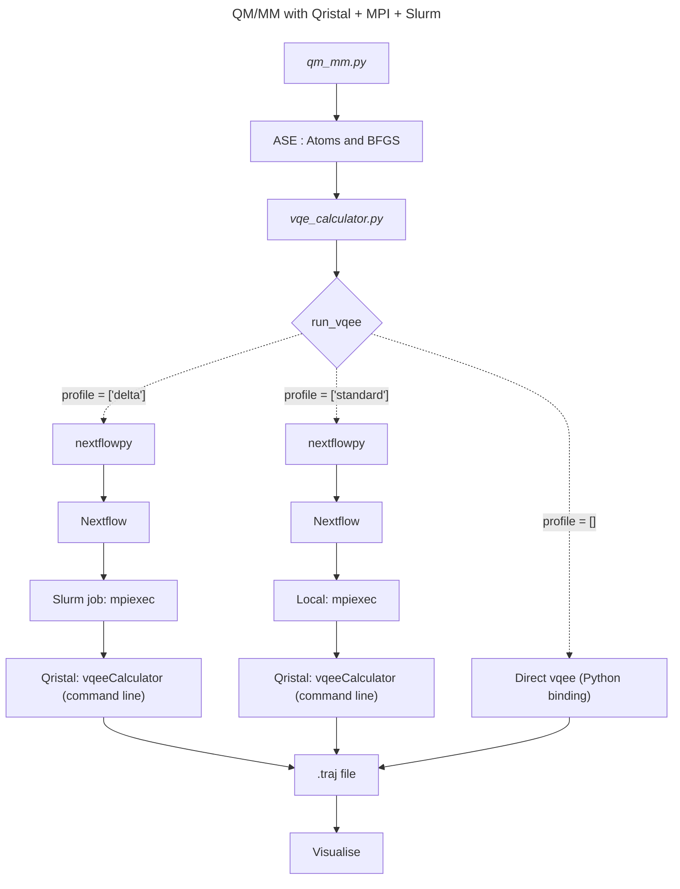

# Quantum chemistry QM/MM using Qristal
This example demonstrates Qristal's **MPI-distributed VQE** and **SLURM** integration via **Nextflow**.

It performs geometry optimisation of $H_2O$ + $H_2$.  The result is visualised below:



$H_2$ is treated using QM.

$H_2O$ is treated using MM.  The TIP3P potential is used, which is designed only for $H_2O$ molecules and does not provide intramolecular forces. For this reason, the $H_2O$ atoms are fixed in space (with the correct geometry), which also reduces the degrees of freedom.


## Running the QM/MM example

### Prerequisite executables that need compiling
`vqeeCalculator` : This is a MPI-aware standalone commandline executable for accessing the VQE functionality of Qristal.  The source code is located [here](https://github.com/qbrilliance/qristal-core/tree/main/examples/cpp/vqeeCalculator) and compilation steps are located [here](https://github.com/qbrilliance/qristal-core/tree/main/examples/cpp/vqeeCalculator#compiling).


### Prerequisite Python modules
```
python3 -m pip install openfermionpyscf
python3 -m pip install nextflowpy
```
### Execute the Python code
**Run without Nextflow:**

        $ python3 qm_mm.py -c <your/path/to>/vqeeCalculator

**Run with Nextflow `'standard'` profile:**

        $ python3 qm_mm.py -c <your/path/to>/vqeeCalculator -p

**Run with Nextflow `'standard'` profile, with given number (4) of QPUs:**

        $ python3 qm_mm.py -c <your/path/to>/vqeeCalculator -p -q 4

**Run with Nextflow `'delta'` (SLURM scheduler enabled) profile:**

        $ python3 qm_mm.py -c <your/path/to>/vqeeCalculator -p delta -q 4

For more details on how the ASE Calculator interface has been used in this example, see the [source code](./qm_mm.py).

## Workflow summary


Changing the `profile` changes the computing resources for executing the energy calculation routine.  For more details on the Nextflow profiles shown above, see [nextflow.config](./nextflow.config).

## Command for generating the above visualisation ([ImageMagick](https://imagemagick.org/) + [ASE](https://wiki.fysik.dtu.dk/ase/faq.html#how-do-i-export-images-from-a-trajectory-to-png-or-pov-files)):
    
The output (`.traj`) file is converted to an **animated GIF** using these commands:
    
 ```bash
# ASE: convert .traj to individual .png frames
for ii in {1..70}; do ase gui opt.traj@$ii -o image$ii.png; done
for ii in {1..9}; do mv image${ii}.png image0${ii}; done

# ImageMagick: multiple png -> animated GIF
convert -background white -alpha remove -layers OptimizePlus -delay 25x100 image*.png -loop 0 qmmm-vqee.gif
```
